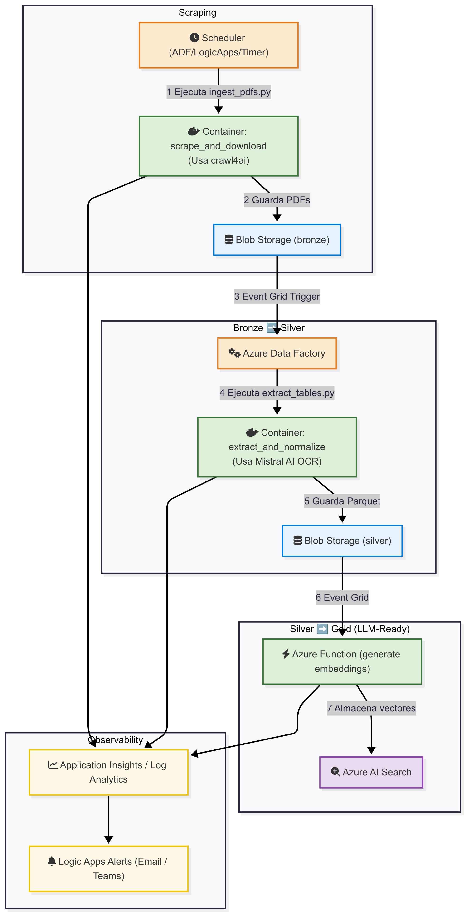

# ✅ Task 3 – Technical Design Document

Basado en el diagrama de arquitectura propuesto, este documento detalla el diseño técnico del pipeline de datos, la estrategia de orquestación y la preparación de datos para consumo en aplicaciones de IA.

---

## 📐 Part 1 - Architecture Diagram

El siguiente diagrama ilustra el flujo completo del pipeline, desde la ingesta de PDFs crudos en la capa Bronze hasta la creación de activos de datos enriquecidos y listos para IA en la capa Gold.

---

## ⚙️ Part 2 – Orchestration and Automation

Nuestra estrategia de orquestación, tal como se ilustra en el diagrama, se basa en un diseño **modular, serverless y orientado a eventos** para garantizar la automatización completa, la escalabilidad y la resiliencia.

### 1. Orchestration Tools

- **Herramienta Principal: Azure Data Factory (ADF).**
  - **Justificación:** ADF es el orquestador central. Es la herramienta ideal porque proporciona:
    1.  **Orquestación Visual:** Permite diseñar, gestionar y monitorear el pipeline completo, desde la ingesta hasta la capa Silver, de forma intuitiva.
    2.  **Triggers Nativos:** Se integra de forma nativa con **Azure Event Grid** para la **detección automática de archivos**, permitiendo reaccionar a los datos en tiempo real.
    3.  **Modularidad:** El pipeline está compuesto por "actividades". La actividad principal es ejecutar nuestro código de extracción, empaquetado en el contenedor `extract_and_normalize`.

### 2. Handling Scheduling, Retries, Versioning, and Scale

- **Automatic Detection of New Files:**
  - El pipeline se inicia automáticamente. Cuando un nuevo PDF aterriza en el contenedor **Blob Storage (bronze)**, **Event Grid** captura el evento `BlobCreated` y activa el pipeline de ADF.

- **Execution Across Layers:**
  - **Bronze → Silver:** ADF orquesta la ejecución del contenedor `extract_and_normalize` en **Azure Container Instances (ACI)**. Este contenedor lee desde Bronze, procesa y escribe el archivo Parquet en **Blob Storage (silver)**.
  - **Silver → Gold:** La llegada del archivo Parquet a Silver dispara otro **Event Grid**, que invoca la **Azure Function `generate embeddings`**. Esta función lee de Silver y escribe los vectores en **Azure AI Search**.

- **Scheduling:**
  - Para la etapa de **Scraping**, un "Schedule Trigger" en ADF ejecuta el contenedor `scrape_and_download` en un intervalo fijo (ej. cada 24 horas).

- **Retries:**
  - ADF tiene una política de reintentos **incorporada a nivel de actividad**. La actividad que ejecuta nuestro contenedor se configuraría para reintentar 3 veces con un intervalo de 5 minutos en caso de fallos transitorios.

- **Versioning:**
  - El pipeline de ADF se integra con un **repositorio de Git (Azure DevOps)**. Cada cambio en el pipeline es un commit, lo que nos proporciona un control de versiones completo y la capacidad de implementar CI/CD.

- **Scale:**
  - La arquitectura es **altamente escalable**. Si se cargan 100 PDFs simultáneamente, Event Grid generará 100 eventos, y ADF puede ejecutar estas actividades en paralelo. El cómputo en **ACI** y **Azure Functions** es serverless, por lo que escala automáticamente para manejar la carga.

- **Metadata Tracking, Logging, and Lineage:**
  - **Logging:** Todos los logs de los contenedores y la Azure Function se envían a **Application Insights / Log Analytics Workspace**.
  - **Lineage:** Para un linaje de datos de nivel empresarial, la solución se integraría con **Microsoft Purview**, que escanearía el Data Lake y se conectaría a ADF para mapear visualmente el flujo de datos.

---

## 🤖 Part 3 – Gold Layer Design for ML & LLMs

La capa Gold transforma los datos de Silver en activos de datos de alto valor, curados y listos para el consumo.

### 1. Gold Layer for Machine Learning (ML)

- **Estructura:** Se crearía una tabla **Delta Lake** llamada `FactFinancialMetrics` sobre Azure Data Lake Storage (ADLS).
- **Normalización y Vinculación:** La tabla tendría un esquema estandarizado: `MetricID`, `MetricName`, `ReportDate`, `Value`, `Currency`, `SourceFile`, `PageNumber`. Se crearía una tabla de dimensiones (`DimMetrics`) para mapear las etiquetas de fila extraídas (ej. "Revenue", "Ingresos") a un `MetricID` único. Esto permite **vincular la misma métrica a través de diferentes trimestres e idiomas**.
- **Soporte Multilingüe:** La tabla `DimMetrics` contendría una columna `Language` (`en-US`, `es-ES`), permitiendo que el pipeline estandarice informes en diferentes idiomas a una taxonomía común.
- **Formatos Estandarizados:** Las fechas se convierten a `YYYY-MM-DD`, las monedas a códigos ISO, y las métricas se estandarizan a través de la `DimMetrics`.

### 2. Gold Layer for LLMs & RAG

- **Estructura:** La capa Gold para LLMs es el índice en **Azure AI Search**.
- **Proceso:** La **Azure Function `generate embeddings`** crea los documentos para este índice. Para cada tabla extraída de Silver, la función:
    1.  Crea un "chunk" de texto contextual que combina el `table_title`, los `column_header`s y los `row_label`s.
    2.  Utiliza un modelo de embeddings de Azure OpenAI para convertir este chunk en un vector numérico.
    3.  Almacena este vector en **Azure AI Search**, junto con metadatos clave (página, título, nombre del archivo).
- **Formatos Compatibles con LLMs:**
    - **Entity-Level Tables:** El archivo Parquet en Silver y la tabla Delta en Gold ya son formatos de entidad.
    - **Embedding-Friendly Formats:** La Azure Function crea explícitamente el formato de texto optimizado para la generación de embeddings.
    - **JSONL:** Se puede generar fácilmente un archivo JSONL a partir de la tabla Delta Lake, donde cada línea es un hecho autocontenido: `{"metric": "Revenue", "period": "2025-03-31", "value": 160560.0, ...}`.

---

## ☁️ Part 4 – Cloud Architecture in Azure

Mapeo de los conceptos a servicios específicos de Azure:

- **Storage:**
  - **Azure Data Lake Storage (ADLS) Gen2:** La base de nuestro data lake, con contenedores para `bronze`, `silver` y `gold`.
  - **Delta Lake:** El formato para las tablas en la capa `gold`, construido sobre ADLS para proporcionar fiabilidad y rendimiento (convirtiendo nuestro data lake en un "Lakehouse").

- **Compute:**
  - **Azure Container Instances (ACI):** Para la ejecución serverless de nuestros scripts de Python.
  - **Azure Functions:** Para la tarea ligera y reactiva de generar embeddings para la capa Gold.
  - **Azure Databricks:** Plataforma opcional para transformaciones Silver → Gold más complejas o a gran escala.
  - **Azure ML:** Sería el **consumidor** de la capa Gold para entrenar modelos.

- **Monitoring:**
  - **Logging:** **Application Insights / Log Analytics Workspace** para centralizar todos los logs.
  - **Alerting:** **Logic Apps** o **Azure Monitor Action Groups** para enviar notificaciones a **Email** o **Microsoft Teams**.
  - **Dashboards:** En **Azure Dashboards** o **Power BI** para visualizar métricas en tiempo real.

- **Security:**
  - **Azure Key Vault:** Para almacenar de forma segura todos los secretos (API keys, etc.).
  - **Managed Identities:** Para que los servicios de cómputo se autentiquen de forma segura sin gestionar credenciales.
  - **RBAC (Role-Based Access Control):** Para asignar permisos granulares siguiendo el principio de mínimo privilegio.